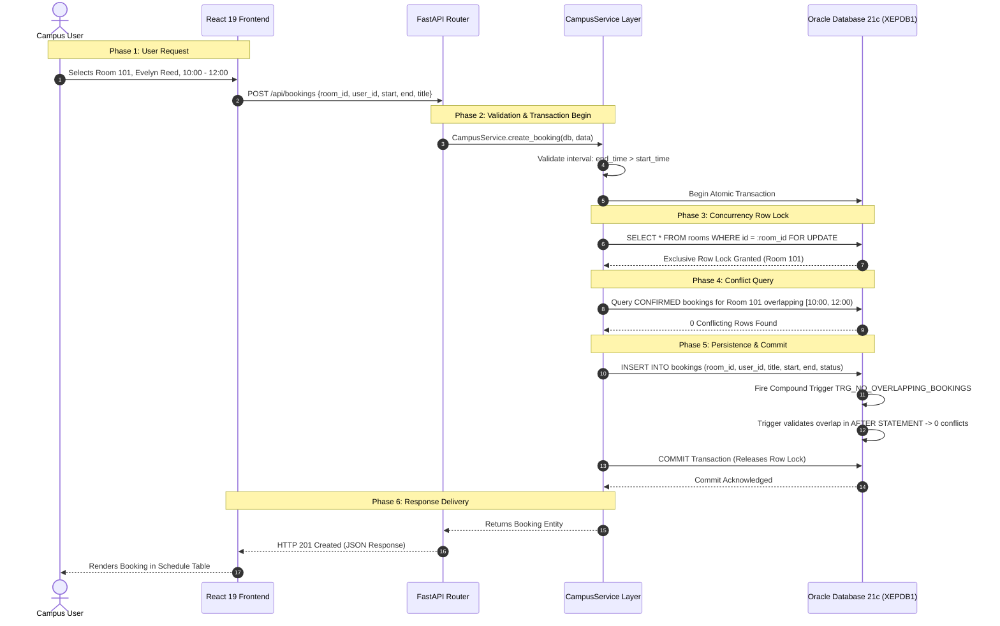

# Application Data Flow Diagram

This sequence diagram illustrates the complete end-to-end data lifecycle from a client browser request to Oracle Database persistence.

---

```mermaid
sequenceDiagram
    autonumber
    actor User as Campus User
    participant UI as React 19 Frontend
    participant API as FastAPI Router
    participant Service as CampusService Layer
    participant DB as Oracle Database 21c (XEPDB1)

    Note over User,UI: Phase 1: User Request
    User->>UI: Selects Room 101, Evelyn Reed, 10:00 - 12:00
    UI->>API: POST /api/bookings {room_id, user_id, start, end, title}

    Note over API,Service: Phase 2: Validation & Transaction Begin
    API->>Service: CampusService.create_booking(db, data)
    Service->>Service: Validate interval: end_time > start_time
    Service->>DB: Begin Atomic Transaction

    Note over Service,DB: Phase 3: Concurrency Row Lock
    Service->>DB: SELECT * FROM rooms WHERE id = :room_id FOR UPDATE
    DB-->>Service: Exclusive Row Lock Granted (Room 101)

    Note over Service,DB: Phase 4: Conflict Query
    Service->>DB: Query CONFIRMED bookings for Room 101 overlapping [10:00, 12:00)
    DB-->>Service: 0 Conflicting Rows Found

    Note over Service,DB: Phase 5: Persistence & Commit
    Service->>DB: INSERT INTO bookings (room_id, user_id, title, start, end, status)
    DB->>DB: Fire Compound Trigger TRG_NO_OVERLAPPING_BOOKINGS
    DB->>DB: Trigger validates overlap in AFTER STATEMENT -> 0 conflicts
    Service->>DB: COMMIT Transaction (Releases Row Lock)
    DB-->>Service: Commit Acknowledged

    Note over Service,UI: Phase 6: Response Delivery
    Service-->>API: Returns Booking Entity
    API-->>UI: HTTP 201 Created (JSON Response)
    UI-->>User: Renders Booking in Schedule Table
```
