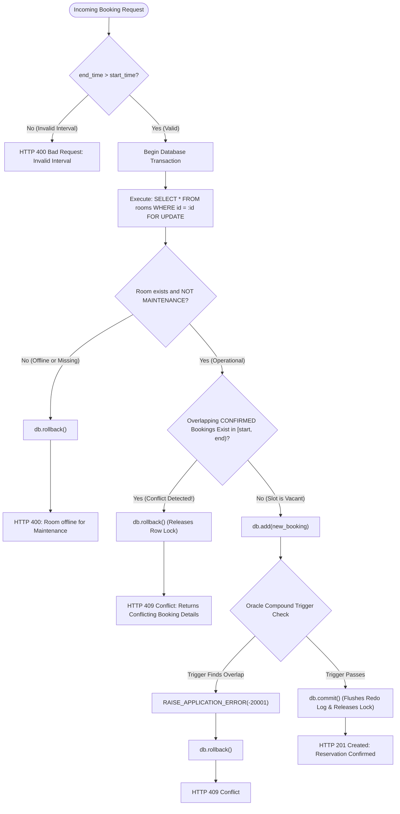

# Booking Transaction & Conflict Flowchart

This flowchart documents the decision logic executed during room reservation processing.

---

```mermaid
flowchart TD
    Start(["Incoming Booking Request"]) --> CheckInterval{"end_time > start_time?"}
    
    CheckInterval -- "No (Invalid Interval)" --> Raise400["HTTP 400 Bad Request: Invalid Interval"]
    
    CheckInterval -- "Yes (Valid)" --> BeginTx["Begin Database Transaction"]
    
    BeginTx --> LockRoom["Execute: SELECT * FROM rooms WHERE id = :id FOR UPDATE"]
    
    LockRoom --> RoomExists{"Room exists and NOT MAINTENANCE?"}
    
    RoomExists -- "No (Offline or Missing)" --> RollbackMaint["db.rollback()"]
    RollbackMaint --> Raise400Maint["HTTP 400: Room offline for Maintenance"]
    
    RoomExists -- "Yes (Operational)" --> CheckConflict{"Overlapping CONFIRMED Bookings Exist in [start, end)?"}
    
    CheckConflict -- "Yes (Conflict Detected!)" --> RollbackConflict["db.rollback() (Releases Row Lock)"]
    RollbackConflict --> Raise409["HTTP 409 Conflict: Returns Conflicting Booking Details"]
    
    CheckConflict -- "No (Slot is Vacant)" --> InsertBooking["db.add(new_booking)"]
    
    InsertBooking --> TriggerCheck{"Oracle Compound Trigger Check"}
    
    TriggerCheck -- "Trigger Finds Overlap" --> TriggerError["RAISE_APPLICATION_ERROR(-20001)"]
    TriggerError --> RollbackTrigger["db.rollback()"]
    RollbackTrigger --> Raise409Trigger["HTTP 409 Conflict"]
    
    TriggerCheck -- "Trigger Passes" --> CommitTx["db.commit() (Flushes Redo Log & Releases Lock)"]
    CommitTx --> Success["HTTP 201 Created: Reservation Confirmed"]
```
